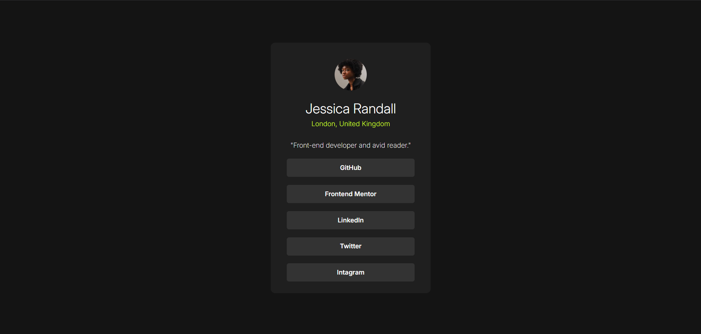

# Social links profile solution

Es la solucion al tercer reto de FrontEnd Mentor

## Table of contents

- [Overview](#overview)

  - [Screenshot](#screenshot)
  - [Links](#links)
- [Built with](#built-with)
- [Author](#author)

## Overview

### The challenge

Users should be able to:

- See hover and focus states for all interactive elements on the page

### Screenshot

### Links

- Live Site URL: [Live SIte](https://sociallinksmelvin.netlify.app/)

### Built with

- Semantic HTML5 markup
- CSS custom properties
- Flexbox
- CSS Grid
- Mobile-first workflow

## Author

- Website - [Melvin Sanchez Vazquez](https://www.your-site.com)
